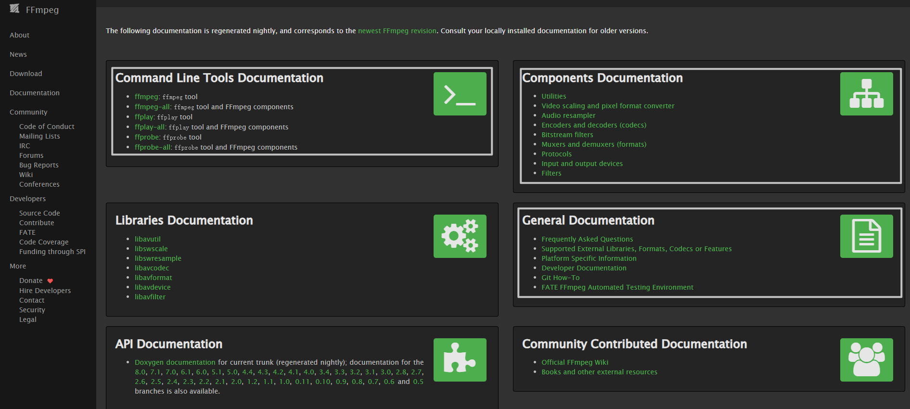

学习ffmpeg，阅读官方文档是必要的。

然而，全英文的内容让英语基础差的人望而生畏。

本仓库基于 Deek Seek + harness，完成这项工作。

翻译基于ffmpeg版本：[ffmpeg-2026-09-10-git-fd7c73d01e-essentials_build.7z](https://www.gyan.dev/ffmpeg/builds/ffmpeg-git-essentials.7z)

## 翻译目标

## 在线预览

[ffmpeg-zh.html](https://here200.github.io/ffmpeg-doc-zh/ffmpeg-zh.html)

[ffplay-zh.html](https://here200.github.io/ffmpeg-doc-zh/ffplay-zh.html)

[ffprobe-zh.html](https://here200.github.io/ffmpeg-doc-zh/ffprobe-zh.html)

